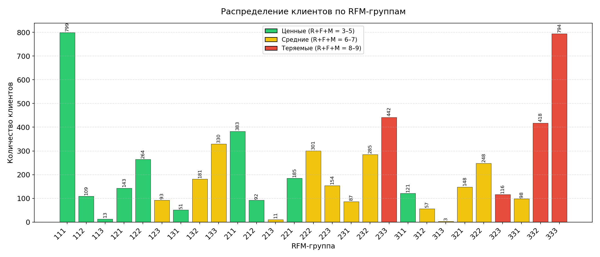

<div align="center">

# **RFM анализ покупателей**

Оценка покупателей по трём показателям — **Recency**, **Frequency** и **Monetary**.

</div>

**Recency** — как давно клиент совершал покупку.  
**Frequency** — число покупок клиента.  
**Monetary** — сумма всех покупок клиента.

Каждый из показателей будет оценён по шкале от **1 до 3** согласно пороговым значениям.  
Ранг **1** — наиболее предпочтителен, **3** — наименее.

По итогам каждый клиент будет определён в свою группу RFM.

> **RFM** — это метод сегментации клиентов, где каждому присваивается оценка по трём параметрам: давность покупки, частота и сумма.

## Описание данных

В проекте используется одна таблица — `bonuscheques`.

| Поле | Тип | Описание |
|------|-----|----------|
| `datetime` | TIMESTAMP | Дата и время покупки |
| `shop` | VARCHAR | Название аптеки |
| `card` | VARCHAR | Номер бонусной карты |
| `bonus_earned` | INT | Количество начисленных бонусов |
| `bonus_spent` | INT | Количество потраченных бонусов |
| `summ` | INT | Сумма чека |
| `summ_with_disc` | INT | Сумма чека с учетом скидок и списаний бонусов |
| `doc_id` | VARCHAR | Номер документа |

> [!IMPORTANT]
> Если в момент покупки касса была в оффлайн-режиме, то вместо номера карты(13 символов)
записывается зашифрованная последовательность символов. В таком случае номер
карты силами этой базы данных никак восстановить нельзя.

## Оценка качества данных: доля неидентифицированных покупателей
Перед проведением анализа необходимо определить доля покупок не привязанных к конкретному клиенту. 
```sql
select case when length(card) = 13 then 'identified' else 'not_identified' end as customer
     , count(*) as qty
     , to_char(round(count(*) / sum(count(*)) over() * 100), '99 %') as perc
  from bonuscheques
 group by customer;
```
**Результат:**

| customer | qty | perc |
|---------------|--------------------|---------------|
| identified | 21 075 | 55 % |
| not_identified | 17 411 | 45 % |
> [!IMPORTANT]
> **Рекомендация бизнесу:** доля неидентифицированных покупателей 
> составляет **45%** — это очень высокий показатель. Почти половина 
> покупок не привязана к клиенту, что искажает аналитику и затрудняет 
> работу с лояльностью. Стоит проверить работу кассового оборудования 
> и процессы фиксации бонусных карт.
## Как определяются ранги R, F, M

Пороговые значения для Recency, Frequency и Monetary рассчитываются 
как **33-й и 66-й процентили** каждого из рядов данных. Эти два значения 
делят ряд на три интервала, каждому из которых соответствует одна из трёх 
групп в RFM-анализе.

Клиенты с наименьшим Recency (покупали недавно) получают ранг **1**, 
с наибольшим — **3**. Аналогично для Frequency и Monetary: чем выше 
показатель, тем лучше ранг.
## Финальный запрос
```sql
-- Шаг 1. Отсеиваем неидентифицированных покупателей и считаем для каждого оставшегося его показатели
with agg_data as(
select card as user_id
     , (select max(datetime)::date from bonuscheques) - max(datetime::date) as recency
     , count(datetime) as frequency
     , sum(summ_with_disc) as monetary
  from bonuscheques
 where length(card) = 13
 group by card
),
-- Шаг 2. Расчёт процентилей
percentiles as(
select (percentile_cont(array[0.33, 0.66]) within group(order by recency))[1] as rec_perc_033
     , (percentile_cont(array[0.33, 0.66]) within group(order by recency))[2] as rec_perc_066
     , (percentile_cont(array[0.33, 0.66]) within group(order by frequency))[1] as freq_perc_033
     , (percentile_cont(array[0.33, 0.66]) within group(order by frequency))[2] as freq_perc_066
     , (percentile_cont(array[0.33, 0.66]) within group(order by monetary))[1] as monet_perc_033
     , (percentile_cont(array[0.33, 0.66]) within group(order by monetary))[2] as monet_perc_066
  from agg_data
),
-- Шаг 3. Расчёт RFM группы покупателя
rfm as(
select user_id
     , case when recency <= (select rec_perc_033 from percentiles) then '1'
            when recency <= (select rec_perc_066 from percentiles) then '2'
            else '3'
            end as recency   
     , case when frequency <= (select freq_perc_033 from percentiles) then '3'
            when frequency <= (select freq_perc_066 from percentiles) then '2'
            else '1'
            end as frequency
     , case when monetary <= (select monet_perc_033 from percentiles) then '3'
            when monetary <= (select monet_perc_066 from percentiles) then '2'  
            else '1'
            end as monetary            
  from agg_data
)
-- Шаг 4. Итоговая сводка по группам
select recency || frequency || monetary as rfm_group
     , count(*) as customers
  from rfm
 group by 1
 order by rfm_group;
```

📄 Файл с запросами: [`queries.sql`](queries.sql)

## Результат запроса
| rfm_group | customers |
|-----------|---------- |
|111|799|
|112|109|
|113|13|
|121|143|
|122|264|
|123|93|
|131|51|
|132|181|
|133|330|
|211|383|
|212|92|
|213|11|
|221|185|
|222|301|
|223|154|
|231|87|
|232|285|
|233|442|
|311|121|
|312|57|
|313|3|
|321|148|
|322|248|
|323|116|
|331|98|
|332|418|
|333|794|
## Визуализация


## Рекомендации по группам покупателей
Общая рекомендация - “вытягивать” группу вверх по каждому из показателей. Чем чаще и на большие суммы покупатели будут совершать покупки, тем лучше для бизнеса.
* Группа `111` - недавние покупатели с частым посещением и крупными покупками. Самые лояльные клиенты. Нужно стараться их не потерять. Возможно, стоит выделить их в отдельную VIP-группу, предложить спецобслуживание, делать подарки в день рождения или какие-то знаковые праздники и т.п.
* Группа `112` - недавние покупатели с частым посещением и средними покупками. Вполне лояльны. Возможно, у них просто нет надобности в крупных покупках. Можно информировать о новинках, акциях, тоже поздравлять с праздниками.
* Группа `113` - недавние покупатели с частым посещением и мелкими покупками.

Группы `11*` - показывают заметно большее число клиентов в самой лучшей группе по сравнению с двумя другими. Возможно, идет процесс перетекания из более слабых групп в предпочтительную `111`. Или наоборот.
 
* Группы `12*` - недавние покупатели со средней частотой визитов. Нужно стимулировать посещать аптеки чаще. Изучить их покупки, рекомендовать потенциально интересные им  товары, информировать об акциях, выгодных предложениях и т.д.
* Группы `13*` - покупали недавно, вероятно — впервые. Предполагаем, что работники аптеки сначала выдали им карты лояльности, по которым те совершили свои первые покупки. Новые клиенты. Пока ничего определенного о них сказать нельзя. Стоит связаться ними для получения обратной связи по их первому визиту. Отталкиваясь от неё уже придумать стратегию дальнейших действий.
По сумме покупок клиенты распределены вполне ожидаемо - больше всего людей с небольшими тратами, почти в два раза меньше “середнячков”. Самых щедрых меньше уже в три с половиной раза, относительно предыдущих. 

* Группы `21*` - давно их не было, но покупали часто. Большая часть из них - на крупные суммы. С мелкими и средними покупками только 20% от общего числа клиентов. Нужно по возможности получить обратную связь, напомнить о себе. Возможно, придумать привлекательную акцию.
* Группы `22*` - давно не заходили, покупали 2-3 раза. В основном на не очень крупные суммы. Примерно половина из всех - настоящие “середнячки”. С крупными и мелкими покупками клиентов примерно поровну.
Напомнить о себе, получить обратную связь. Попытаться понять, что их удерживает от возвращения к покупкам.
* Группы `23*` - давно не было, купили один раз, в основном(чуть больше половины) на мелкие суммы. Новые клиенты, которые не стали постоянными. Только 10% клиентов совершили крупные покупки. Возможно, это были случайные посетители. Возможно, им что-то не понравилось и более они не возвращались. Можно попытаться получить обратную связь, узнать о впечатлении от посещения аптеки. 

* Группы `31*` - очень давно не покупали, но делали это часто. Большая часть клиентов(67%) совершала крупные покупки. Нужно попытаться вернуть их. Есть потенциал перейти в группу `111`. Узнать, почему перестали покупать. Сделать персональное предложение.
* Группы `32*` - очень давно не покупали, сделали это 2-3 раза, половина из них  - на средние суммы. Можно попробовать выяснить, почему перестали покупать. На основе обратной связи придумать персональные предложения.
* Группы `33*` - купили однажды, очень давно. Лишь 8% из них на крупную сумму; средние покупки у 32%; мелкие - у 60%. Скорее всего, случайные покупатели, которые не вернутся. Либо появятся вновь так же случайно. Если есть возможность максимально дешево их реактивировать, стоит попробовать.
